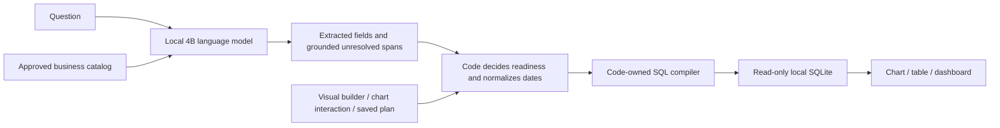

# AIDA — local language understanding, controlled database analytics

AIDA uses a small local language model to interpret a business question, then validates an explicit plan and compiles read-only SQL in code. The result becomes an interactive chart, table or saved dashboard view.

**A bounded model interprets language; code controls execution.** Explicit business definitions, source selection and deterministic compilation keep database access constrained. [Relational verification](docs/RELATIONAL_VERIFICATION.md) records the multi-table model, independent SQL and browser checks; [VERIFICATION.md](docs/VERIFICATION.md) retains the original single-table baseline.

**Current reliability:** the [new 50-question transfer assessment](docs/BLIND_EVALUATION.md) passed all 40 explicit SQL plans but answered only **19/40 supported natural-language questions correctly** and incorrectly executed **6/10 unsupported or ambiguous requests**. This is a working local demonstration with documented language failures; it does **not** pass the release gate for reliable querying across new databases. The frozen results, repeatability/privacy measurements and prioritized fixes are preserved in that report.

[Model, test data and repository status](docs/MODEL_TEST_DATA_AND_REPOSITORY.md) explains the pinned model choice, exactly what enters model prompts, which six databases to use for each test layer, how to evaluate another model, and which repository cleanup remains before publication.

## Start on Windows

Install Python 3.11+ and Node.js 22.9+, then run from this repository:

```powershell
powershell -ExecutionPolicy Bypass -File scripts/start-demo.ps1
```

Open **http://127.0.0.1:3000**. The launcher installs dependencies, downloads and verifies the pinned local runtime and model, builds the frontend, and starts the model, API and website. The initial model download is approximately **2.5 GB**, plus the runtime and application dependencies. Setup requires internet access; inference runs on this computer without a hosted inference key.

The default model is **Qwen3-4B-Instruct-2507**, using the **Q4_K_M** GGUF quantization with **llama.cpp**. Download revisions, SHA-256 hashes, licenses and upstream provenance are pinned in [scripts/model-runtime.json](scripts/model-runtime.json). The model weights come from the [LM Studio community quantization repository](https://huggingface.co/lmstudio-community/Qwen3-4B-Instruct-2507-GGUF), derived from [Qwen's upstream model](https://huggingface.co/Qwen/Qwen3-4B-Instruct-2507). The inference runtime is [llama.cpp](https://github.com/ggml-org/llama.cpp).

Useful startup options:

```powershell
# Reuse installed dependencies, model files and the existing frontend build.
powershell -ExecutionPolicy Bypass -File scripts/start-demo.ps1 -SkipInstall -SkipBuild

# Use CPU inference if Vulkan/GPU initialization fails.
powershell -ExecutionPolicy Bypass -File scripts/start-demo.ps1 -GpuLayers 0

# Expose only the bundled demo sources through the application.
powershell -ExecutionPolicy Bypass -File scripts/start-demo.ps1 -PublicDemo

# Stop this demo's model, backend and frontend.
powershell -ExecutionPolicy Bypass -File scripts/stop-demo.ps1
```

The services bind to loopback: website **3000**, backend **8000**, and local inference **8081**. Logs and process records are under `artifacts/`; model files are under `.runtime/`. CPU inference can take considerably longer than SQL execution. The launcher disables llama.cpp's auxiliary multi-prompt RAM cache (`--cache-ram 0`); AIDA still caches exact semantic plans. The interface reports model availability and separates model calls, token usage, interpretation cache hits and database execution.

## How a question becomes a result



The model receives the question and an allowlisted projection of approved metric definitions, dimension labels, and explicitly approved categorical values and aliases. It receives no database rows, result samples, arbitrary schema dump, SQL connection details or filesystem paths. Metric and dimension identifiers become temporary tokens such as `m0` and `d0`. Constrained output permits canonical filter values grounded in the question and exact copied temporal spans; code resolves calendar dates. The question itself may contain sensitive text, so the configured inference endpoint is restricted to loopback, with proxies and redirects disabled.

Each uncached question uses at most one bounded model request. The model extracts measures, groupings, filters, time expression, sort and limit, plus any unresolved phrase copied from the question with an allowed reason. Relational catalogs also support aggregate thresholds, approved related-record checks, above-average comparisons and current/archive population selection. The model does not emit SQL, choose physical join keys, decide readiness or invent follow-up questions. Code validates all fields and unresolved spans, chooses the required approved table paths, and decides whether execution is allowed. Unsupported or malformed intent returns a code-owned clarification; model failure is visible and has no hidden hosted-model or regex fallback.

Omitted dates and filters mean the full available source. Grouping by month does not require a date window. Fixed metric conditions still apply within the requested subset: average order value filtered to Pending is valid and returns null because that metric only includes completed orders.

**Deterministic execution does not make language interpretation infallible.** The model can still misunderstand a valid request. Temperature zero, a fixed seed and structural validation improve repeatability and constrain execution, but do not prove semantic correctness. Inspect the displayed metric definition, filters and date range. The verification report distinguishes actual model evaluations from stub-based API tests.

The visual builder, chart interactions and saved dashboard plans bypass language interpretation. Accepted question interpretations and canonical execution plans use bounded caches. Cache hits reduce repeated inference; local hardware, electricity and hosting still cost money even though there are no hosted model API charges.

## Five independent demo sources

| Source | Approved metrics | Groupings | Relative-date reference |
| --- | --- | --- | --- |
| Commerce demo | Revenue, orders, average order value | Region, category, channel, status, month | December 31, 2025 |
| Support operations demo | Tickets, average resolution time | Team, priority, state, month | June 30, 2026 |
| Retail warehouse (`warehouse`) | Revenue, units, distinct orders, average line value, order lines | Region, category, order status, sales channel, customer segment, month | September 12, 2026 |
| SaaS billing (`billing`) | Billed amount, seats, distinct invoices, average line amount, billing lines | Account segment, plan tier, invoice status, billing country, month | September 12, 2026 |
| Chinook music store (`chinook`) | Units sold, average sale price, distinct invoices, invoice lines | Customer country, billing country, album, month | December 31, 2013 |

Commerce revenue sums completed order amounts; other statuses contribute zero. Order count includes all statuses unless filtered. Average order value includes completed orders only. Monetary values are stored in cents and displayed in USD.

Support ticket count includes open and resolved tickets. Average resolution time uses resolution hours from resolved tickets; open tickets are excluded. Switching sources changes the catalog, date reference, executed database and visible saved dashboard cards.

Try `Revenue by region`, `Revenue in West last month`, and `Average order value by channel`. Then switch to Support operations and try `Tickets by team`, `Average resolution time by priority`, or `Tickets last month`. These are intended walkthrough examples; consult the live evaluation report for measured outcomes.

The retail and billing fixtures contain multiple related tables, same-named status/amount columns, missing foreign keys, nullable measures, duplicate child events, and overlapping current/archive records. Retail revenue is the sum of **line totals across all order statuses unless filtered**, which differs from the original Commerce demo definition. Billing measures operate at invoice-line grain. Counts of orders or invoices use approved distinct identifiers, avoiding accidental multiplication across line items.

Chinook is an unmodified public music-store sample with 11 tables, bundled with its [MIT license and pinned provenance](fixtures/chinook/README.md). Its reporting catalog approves selected relationships; it does not expose every physical column. `Average sale price by customer country where catalog price is greater than 1` deliberately uses the sale price from invoice lines and a filter on the track catalog price. `Units sold by album for customer country USA` requires two separate join paths. Result lineage shows the actual tables, columns and keys used.

Relational examples include `Revenue and units by region`, `Revenue by region and category for completed orders`, `Categories with revenue above 30000`, `Revenue by category for lines with damaged returns`, `Regions with above-average revenue`, and `Revenue by month including current and archived records`. Each question still produces one semantic intent; the compiler owns joins, subqueries and set operations.

## Onboard a local SQLite snapshot

**Connect a database directly:** the local **Data catalog → Database connections** flow now implements PostgreSQL, MySQL and SQL Server extraction into managed reporting snapshots, encrypted credentials, manual/hourly/daily refresh and refresh history. The [connection guide](docs/CONNECTIONS.md) covers read-only accounts, TLS, operator host approval, key management and the full workflow, including where the LLM is called. SQL Server requires ODBC Driver 18 on the backend host. See [connector verification](docs/CONNECTOR_VERIFICATION.md) for tested boundaries and remaining live-vendor qualification.

In local mode, open **Data catalog** and upload a standalone SQLite database snapshot, up to **20 MB**. Inspection reads table and column metadata without sampling rows. The application assigns an opaque source ID; the uploaded filename cannot choose a server path.

Choose **Single table** to approve a reporting table, metric labels and business definitions, numeric measure columns, categorical dimensions, and an optional date column with an explicit reference date. For multiple tables, choose **Relational catalog**, inspect declared columns/keys, and paste an owner-reviewed version 2 catalog JSON. The server validates physical mappings and join cardinality against the snapshot. The source remains unavailable to queries until its catalog is accepted. All queries and dashboard cards carry its source ID and catalog version.

Single-table mappings support `COUNT`, `SUM`, `AVG`, `MIN` and `MAX`. Relational manifests additionally support approved `COUNT_DISTINCT` measures. A scale divisor converts stored units, such as 100 for cents. See the explicit manifests in [relational_demo.py](backend/core/relational_demo.py) and [chinook.py](backend/core/chinook.py) for the version 2 contract. Relational mappings define one fact-row grain, directed many-to-one relationships with verified unique target keys, optional related-record populations for EXISTS, and an optional compatible archive table. The application never guesses that a numeric identifier is revenue or invents relationships from similar column names.

Primary keys and columns whose names suggest personal identifiers, credentials or free text are excluded by default. This is a conservative naming heuristic plus explicit owner approval, **not an automatic guarantee that every permitted column is anonymous**. Review dimensions and prepare de-identified reporting tables where necessary. There is no minimum-group-size or differential-privacy mechanism.

Snapshots must contain ordinary tables and indexes; views, triggers, virtual tables and generated columns are rejected. Date queries require ISO `YYYY-MM-DD` dates or ISO timestamps and compare their calendar date portion. Nonnumeric values in an approved numeric measure cause a controlled error.

Private snapshots and their approved manifests persist in the configured data directory. Uploaded files remain static. Connected sources can be manually or periodically refreshed through the workflow above. Application-user authentication, tenant authorization, continuous live queries, incremental extraction and shared server-side dashboards are not implemented.

## Interactive analysis and boundaries

The explorer provides charts, tables, CSV export, visible metric definitions, SQL, bound parameters and table/column lineage. Relational analysis supports up to **three measures and two groupings**, AND-combined equality/inequality/IN filters, numeric record comparisons, inclusive dates, ordering and up to 100 result groups. Aggregate thresholds compile to HAVING. Related-record inclusion/exclusion compiles to EXISTS/NOT EXISTS, so repeated child events do not multiply amounts. Above-average group comparisons use a subquery over grouped results. An approved current/archive population compiles to UNION ALL or whole-record UNION before aggregation. The original single-table builder remains available for simpler sources.

Chart choices depend on the returned data: bars work for grouped results, multiple measures have separately labeled scales, monthly results support line and area charts, an explicitly additive, nonnegative single measure across at most 12 groups supports a donut, and two numeric measures support a scatter plot. Averages and distinct counts are excluded from donut charts because their group values cannot be summed into a meaningful total. Missing measures stay missing, temporal charts retain gaps, and charts with incompatible data are not offered. Saved dashboard cards retain the source ID, catalog version, query plan and chart choice in this browser and execute that plan again when refreshed. Chart drilldowns update a structured filter directly without model inference.

The relational compiler is bounded to one approved fact grain and directed, verified relationships. Arbitrary SQL, arbitrary user-defined joins, unrestricted OR expressions, window functions, free-form nested subqueries, cross-database joins and unspecified calculations are outside this demo. Supported subqueries and set operations are explicit plan operations, not an open SQL-generation surface.

Dashboard storage contains no result rows, but labels and filter values can still be sensitive. CSV export intentionally writes the displayed aggregate results to the user's device. Aggregates can also be sensitive; read-only execution prevents writes, not every possible inference about a dataset.

SQL uses quoted identifiers from the approved source manifest and bound values. SQLite runs in read-only and query-only mode with an authorizer, restricted tables/columns/functions, a two-second execution deadline and a 100-row result bound. Uploaded snapshots have separate identities and cached plans include their source and catalog version.

## Demonstration and deployment status

Use [DEMO_GUIDE.md](docs/DEMO_GUIDE.md) for the product walkthrough. Run with `-PublicDemo` for a bundled-data demonstration: private sources are hidden, and upload/configuration endpoints are disabled. Bundled sources include synthetic fixtures and the public Chinook sample. That option still starts the services on loopback; it does not deploy a public website.

A public deployment needs a configured hosting target, HTTPS and resource/rate controls. Keep the model and backend private. Docker packaging is present but its execution has not been verified here; it is not presented as a tested one-command deployment. No public URL is created by the local launcher.

## Verify the current implementation

From the repository root:

```powershell
.\.venv\Scripts\python.exe -m pytest backend -q
.\.venv\Scripts\python.exe validate_structure.py
```

In `frontend/`:

```powershell
npm.cmd run build
npm.cmd run typecheck
node scripts/check-relational-presentation.cjs
```

On Windows, stop the frontend before rebuilding if its running standalone server locks `.next/standalone`. The packaged stop/start commands below stop and restart only this demo's verified processes.

With the local model running, execute the suites sequentially:

```powershell
.\.venv\Scripts\python.exe scripts/evaluate_semantics.py --suite acceptance --output artifacts/semantic-acceptance.json
.\.venv\Scripts\python.exe scripts/evaluate_semantics.py --suite regression --output artifacts/semantic-evaluation.json
.\.venv\Scripts\python.exe scripts/evaluate_semantics.py --suite challenge-regression --output artifacts/semantic-challenge-regression.json
.\.venv\Scripts\python.exe scripts/evaluate_semantics.py --suite forward --output artifacts/semantic-forward.json
```

The acceptance suite covers all 16 starter questions plus six browser-workflow questions. For the browser test, restart the packaged demo to clear backend interpretation caches, then create the synthetic upload fixture:

```powershell
powershell -ExecutionPolicy Bypass -File scripts/stop-demo.ps1
powershell -ExecutionPolicy Bypass -File scripts/start-demo.ps1 -SkipInstall -SkipBuild
.\.venv\Scripts\python.exe scripts/create-e2e-source.py
node scripts/e2e.cjs
```

To verify relational inference and complete browser workflows, run the actual model evaluator first. Its expected rows come from independently authored SQL; expected plans and oracle rows are never sent to the model:

```powershell
.\.venv\Scripts\python.exe scripts/evaluate_relational.py --suite all --output artifacts/relational-evaluation.json --label regression
.\.venv\Scripts\python.exe scripts/prepare-relational-e2e.py

# Clear interpretation caches before the relational browser journey.
powershell -ExecutionPolicy Bypass -File scripts/stop-demo.ps1
powershell -ExecutionPolicy Bypass -File scripts/start-demo.ps1 -SkipInstall -SkipBuild
node scripts/e2e-relational.cjs
```

Keep the model evaluation and both browser suites sequential, with a fresh backend before each browser suite. The relational checks cover different join paths, misleading same-named columns, aggregation grain, record and aggregate filters, related-record subqueries, average comparisons, set operations, chart presentations and dashboard refresh. See the verification report for the current results and any failing cases; these fixed regression cases are not a general accuracy guarantee.

Use local mode for the full browser journey because it includes SQLite onboarding. Add `-GpuLayers 0` to the restart command when using CPU inference. Keep the backend fresh until the browser test starts so its first-question cache assertion remains meaningful. Do not run model evaluations and browser tests concurrently; local inference admits one active request. The semantic evaluation checks real inference against expected plans and independently written SQL over both demo schemas. Parser-stub tests prove API wiring and failure handling only. Exact counts, timings, environment and remaining failures are maintained in [VERIFICATION.md](docs/VERIFICATION.md).

## API examples

| Endpoint | Purpose |
| --- | --- |
| `GET /api/v1/health` | API health and current model status |
| `GET /api/v1/sources` | Available sources and upload-mode status |
| `POST /api/v1/sources` | Local-mode binary SQLite upload; `application/octet-stream` and optional `X-Source-Name` |
| `GET /api/v1/sources/{id}` | Inspect uploaded schema metadata |
| `POST /api/v1/sources/{id}/configure` | Save explicit reporting mappings |
| `GET /api/v1/catalog?source_id=support` | Approved source catalog |
| `POST /api/v1/query` | A source ID and either a question or a plan |
| `GET /api/v1/examples?source_id=support` | Source-specific starter questions |

```json
{"source_id":"support","question":"Average resolution time by priority"}
```

```json
{
  "source_id": "commerce",
  "plan": {
    "metric": "revenue",
    "dimension": "category",
    "filters": {"region": "West"},
    "date_from": "2025-10-01",
    "date_to": "2025-12-31",
    "sort": "value_desc",
    "limit": 5
  }
}
```

A successful response contains `source_id`, `data`, `plan`, `sql`, `parameters`, `chart`, `explanation` and `meta`; interpreted questions also include `semantic_ir`. Unsupported meaning returns `success:false` with a clarification. Missing inference returns `model_unavailable`; malformed request shapes use HTTP 422. Backend interactive API documentation is at `http://127.0.0.1:8000/docs`.
