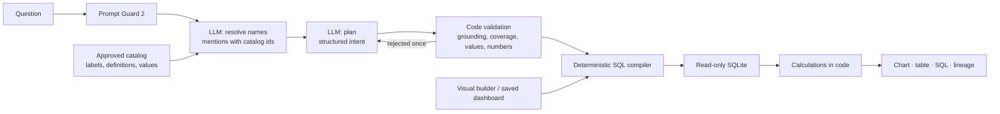

# AIDA — Artificial Intelligence Data Analyst

AIDA answers business questions over approved databases. A language model interprets what you mean and resolves your words to approved business definitions; deterministic code validates that interpretation and compiles read-only SQL. Every answer arrives as an interactive chart, a searchable table, the exact SQL and its lineage.

**Language understands. Code verifies.** The model never writes SQL and never sees database rows. It returns a structured plan over temporary catalog ids, and code refuses any plan that quotes words that are not in the question, drops or adds a condition, uses an unapproved value or cites a number the user never typed.

- [Benchmark report](docs/BENCHMARK.md): model selection, before/after comparison and cost.
- [Test data and queries](docs/TEST_QUERIES.md): the sample databases and questions to try, with measured pass/fail.
- [Security controls and attack tests](docs/SECURITY.md).
- [Model, test data and repository status](docs/MODEL_TEST_DATA_AND_REPOSITORY.md).
- [Parchment + Olive theme](docs/THEME.md): shared palette, typography, brand assets and registration flow.

## What changed in AIDA 4

| Area | Before | AIDA 4 |
| --- | --- | --- |
| Interpretation | One model call plus hand-written language rules and candidate lists | LLM-first pipeline: Prompt Guard screen → resolve names → plan → code validation, with one optional repair round |
| Unresolved or ambiguous names | Refused, or failed silently | The resolver asks you to choose between catalog items and returns rewritten example questions |
| Calculations | Only pre-approved measures | Ratios, differences, share of total, running totals and month-over-month change, computed in code after aggregation |
| Time | Copied phrases parsed by code | Structured calendar, relative, trailing and range periods resolved against the dataset's as-of date; future periods are refused |
| Model provider | Local Qwen3-4B only | Groq (default) or the local llama.cpp runtime |
| Accounts | None | Sign-up, sign-in, onboarding, owner role, private uploads per account |
| Abuse controls | Loopback only | Rate limits, lockouts, CSRF protection, misuse pauses, audit log, security headers |
| Results | Chart and plain table | Chart types that follow the data (including calculations), plus table search, per-column filters, sorting, paging and CSV export of the filtered rows |
| Website | Workspace only | Landing page, sign-in, sign-up, four-step onboarding, then the workspace at `/workspace` |

## Run it on Windows

Requirements: Python 3.11+, Node.js 22.9+ and a Groq API key.

```powershell
python -m venv .venv
.\.venv\Scripts\python.exe -m pip install -r backend\requirements.txt
Copy-Item backend\.env.example backend\.env   # then put your key in GROQ_API_KEY
.\.venv\Scripts\python.exe -m uvicorn backend.main:app --host 127.0.0.1 --port 8000
```

In a second terminal:

```powershell
Set-Location frontend
npm ci
npm run dev
```

Open **http://localhost:3000**, create an account (the first account becomes the owner), complete onboarding and ask a question. If port 8000 is taken, start the backend on another port and set `BACKEND_URL`, for example `set BACKEND_URL=http://127.0.0.1:8010&& npm run dev`.

`backend/.env` is gitignored. The settings that matter:

| Variable | Default | Meaning |
| --- | --- | --- |
| `AIDA_MODEL_PROVIDER` | `local` | `groq` for hosted inference, `local` for llama.cpp on `127.0.0.1:8081` |
| `GROQ_API_KEY` | none | Your Groq key; never returned by the API |
| `AIDA_GROQ_MODEL` | `openai/gpt-oss-120b` | Interpretation model; see the benchmark report before changing it |
| `AIDA_PIPELINE` | `two_stage` | `two_stage` (resolve, then plan) or `single` |
| `AIDA_REPAIR_ATTEMPTS` | `1` | Send the exact rejection back to the model once before asking you to rephrase |
| `AIDA_GUARD_MODEL` | Prompt Guard 2 86M | Prompt-attack screen on Groq; empty disables it |
| `AIDA_REQUIRE_AUTH` | `1` | Require accounts for every data endpoint |
| `AIDA_COOKIE_SECURE` | `0` | Set to `1` behind HTTPS |
| `AIDA_ALLOW_SIGNUP` | `1` | Set to `0` to stop new registrations |

The previous local-model launcher (`scripts/start-demo.ps1`, Qwen3-4B through llama.cpp) is still present for `AIDA_MODEL_PROVIDER=local`. It has not been re-verified end to end with AIDA 4, and the benchmark numbers in this repository were measured on Groq.

## Deploy the public landing page (preview mode)

The landing page and `/benchmarks` can be published on their own, for example to link from a portfolio. Set `NEXT_PUBLIC_AIDA_MODE=preview` at build time. Navigation keeps **Sign up** and **Sign in**. Sign-up records a name, email and consent, then opens `/waitlist` only after the storage endpoint confirms `stored: true`; this registers interest and does not create an authenticated account. Sign-in explains that workspace access is paused and offers availability updates. Onboarding and workspace routes use the same registration fallback, as do normal builds when the backend is unavailable. The API proxy returns 503 instead of contacting a backend in preview mode. No Python backend or model key is needed to serve the site; configure Supabase or a webhook to save registrations. [docs/DEPLOYMENT.md](docs/DEPLOYMENT.md) covers that setup, and [docs/THEME.md](docs/THEME.md) describes the shared theme and account flow.

On Vercel (free Hobby plan):

1. **Add New → Project**, import this GitHub repository, and set **Root Directory** to `frontend`.
2. Add the environment variable `NEXT_PUBLIC_AIDA_MODE` = `preview`.
3. Deploy. To publish from a branch other than the default, set it under **Settings → Environments → Production → Branch Tracking**.
4. Optionally add a subdomain such as `aida.yourdomain.com` under **Settings → Domains** and create the CNAME record Vercel shows at your DNS provider. Subdomains cost nothing beyond the domain itself.

With the Vercel CLI instead: run `vercel login` once, then from `frontend/` run `vercel deploy --prod --build-env NEXT_PUBLIC_AIDA_MODE=preview --env NEXT_PUBLIC_AIDA_MODE=preview`. `frontend/.vercelignore` keeps local `.env` files out of the upload.

Rebuild without the variable (or deploy the full stack) to enable accounts and the workspace.

## How a question becomes a result



1. **Screen.** Prompt Guard 2 scores the question. Instruction-override attempts stop here.
2. **Resolve.** The model lists every meaningful phrase with its role (measure, grouping, filter, threshold, time, sort, limit, calculation and so on), the catalog id it maps to, and whether the match was exact, a synonym or inferred. When a name is ambiguous or missing, it returns a clarification with options instead.
3. **Plan.** The model turns the validated mentions into a structured intent.
4. **Validate.** Code checks that each quoted phrase is in the question, that every phrase is represented and nothing was added, that ids and values are approved, that numbers were typed by the user, and that the request fits the source's capabilities. One repair round can fix a rejected reply.
5. **Execute.** The existing compilers build parameterized SQL over approved tables and relationships. Calculations run in Python on the aggregated rows.

The model receives the question and a compact projection of the approved catalog: temporary ids, labels, plain-language definitions, allowed values, the dataset date range and capability limits. It never receives rows, results, SQL, table or column names, file paths or credentials. With the Groq provider this projection and the question leave the server over HTTPS, which onboarding explains and asks consent for.

The visual builder, chart drilldowns and saved dashboards execute plans directly with no model call.

## Sample sources

| Source | Kind | Good questions to start with |
| --- | --- | --- |
| Commerce demo | Synthetic, single table | `Top 3 categories by revenue in Q3 2025` · `Share of revenue by region` |
| Support operations | Synthetic, single table | `Tickets by team` · `Average resolution time by priority` |
| Retail warehouse (`warehouse`) | Synthetic, multi-table with archives | `Revenue per unit by category, highest first` · `Units share by region` |
| SaaS billing (`billing`) | Synthetic, multi-table | `Billed amount per seat by plan tier` |
| Chinook music store (`chinook`) | Public 11-table sample | `Units sold by album for customer country USA` |
| Logistics sample | Synthetic 12-table (fixtures/blind_logistics), installed privately during onboarding | `Handling charges by carrier for Express service` |

[docs/TEST_QUERIES.md](docs/TEST_QUERIES.md) lists the benchmark questions for each source with their measured outcomes.

## Upload your own SQLite snapshot

### Connect a database and schedule refresh

The local **Data catalog → Database connections** flow supports PostgreSQL, MySQL and SQL Server adapters with explicit table/column selection, encrypted credentials, background snapshots, manual/hourly/daily refresh and refresh history. Connections and generated snapshots belong to the signed-in account; source ownership, CSRF checks and rate limits apply. SQL Server requires Microsoft ODBC Driver 18. Follow [CONNECTIONS.md](docs/CONNECTIONS.md) for credentials, TLS, operator-approved destinations and setup. [Connector verification](docs/CONNECTOR_VERIFICATION.md) distinguishes workflow tests from pending live-vendor qualification. These operations make no LLM calls; questions retain the AIDA 4 interpretation pipeline.

### Upload a standalone file

Open **Data catalog**, upload a SQLite snapshot of up to 20 MB and approve a single-table mapping or a relational catalog. Inspection reads metadata only. Uploaded sources are visible only to the account that uploaded them and are unavailable until their catalog is approved. Columns whose names suggest personal identifiers are excluded by default; review the catalog before approving it, because name-based exclusion is not a privacy guarantee.

## Verify

```powershell
.\.venv\Scripts\python.exe -m pytest backend -q          # 323 tests, including 32 attack and misuse tests
.\.venv\Scripts\python.exe validate_structure.py
Set-Location frontend; npm run typecheck; npm run build; Set-Location ..
```

Engineering benchmark with no model calls: engine speed and correctness against independent SQL, replay of recorded model outputs through the current code, and test gates:

```powershell
.\.venv\Scripts\python.exe scripts/benchmark_engine.py --runs aida4-two_stage-qwen3.8-27b-selection
```

Real-model benchmark (uses your Groq quota; resumable across rate-limit windows):

```powershell
.\.venv\Scripts\python.exe scripts/benchmark_nl.py --label my-run --subset selection
.\.venv\Scripts\python.exe scripts/benchmark_nl.py --label my-run --resume --patience 1800
```

Browser journey for accounts, onboarding and the workspace (backend and frontend running):

```powershell
$env:AIDA_BASE_URL = "http://localhost:3000"; node scripts/e2e-auth.cjs
```

`scripts/e2e.cjs`, `scripts/e2e-blind.cjs` and `scripts/e2e-relational.cjs` are browser suites from the single-call local-model version. They have not been updated for accounts or the two-stage pipeline.

## API

All data endpoints require a session cookie when authentication is enabled, and every write needs the `X-AIDA-Request: 1` header.

| Endpoint | Purpose |
| --- | --- |
| `GET /api/v1/health` | Health, model status and whether authentication is required |
| `GET /api/v1/auth/session` | Current user and onboarding state |
| `POST /api/v1/auth/signup`, `/auth/login`, `/auth/logout` | Accounts and sessions |
| `POST /api/v1/onboarding` | Save onboarding; optionally installs the private logistics sample |
| `GET /api/v1/security/events` | Owner-only security event log |
| `GET /api/v1/sources` · `POST /api/v1/sources` | List sources · upload a SQLite snapshot |
| `GET /api/v1/sources/{id}` · `POST /api/v1/sources/{id}/configure` | Inspect · approve a catalog |
| `POST /api/v1/samples/logistics` | Install the logistics sample for this account |
| `GET /api/v1/catalog?source_id=…` · `GET /api/v1/examples?source_id=…` | Approved catalog · starter questions |
| `POST /api/v1/query` | `{"source_id", "question"}` or `{"source_id", "plan"}` |

A successful interpreted answer includes `data`, `plan` (with any `calculations`), `sql`, `parameters`, `chart`, `lineage`, `interpretation` (notes and resolved mentions), `semantic_ir` and `meta` (model calls, tokens, latency and estimated cost). A clarification returns `success: false` with `clarification_reason` and `suggestions`. Rate limits and misuse pauses return HTTP 429 with `Retry-After`.

---

Designed and built by Ghanashyam.
