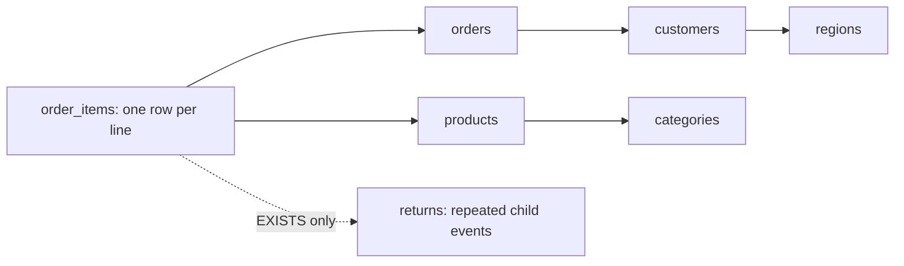

# Approve a relational database for AIDA

AIDA interprets questions using approved business labels, then resolves those labels to physical tables and columns through a deterministic catalog. The model does not write SQL or choose arbitrary joins. A relational catalog is a version 2 JSON document that an owner reviews against a particular SQLite snapshot.

Ready-to-paste catalogs are included for three databases:

| Catalog JSON | Matching database | Fact grain | Example question |
| --- | --- | --- | --- |
| [warehouse.json](../fixtures/catalogs/warehouse.json) | `backend/data/sources/warehouse.sqlite`, created when the app starts | One order-line record | Revenue by region and category for completed orders |
| [billing.json](../fixtures/catalogs/billing.json) | `backend/data/sources/billing.sqlite`, created when the app starts | One invoice-line record | Billed amount and seats by account segment |
| [chinook.json](../fixtures/catalogs/chinook.json) | [Chinook_Sqlite.sqlite](../fixtures/chinook/Chinook_Sqlite.sqlite) | One purchased invoice line | Average sale price by customer country where catalog price is greater than 1 |

Warehouse and billing are generated synthetic datasets with deliberate nulls, repeated child events, overlapping archives, and misleading same-named columns. Chinook is an unmodified third-party public sample; its [provenance and license](../fixtures/chinook/README.md) are retained. These JSON files match the current manifest functions and contain complete mappings, rather than placeholders. A different database requires its own reviewed mappings.

## Upload and configure through the product

1. Start the local app and open **Connect your SQLite database**. Upload the matching `.sqlite` file using **Choose SQLite file**. Uploads accept snapshots up to 20 MB; use a complete SQLite backup that includes committed WAL changes.
2. Select **Relational catalog**. Expand **Inspect tables, columns, and declared keys** to review the uploaded schema. Inspection reads schema metadata without sampling customer rows.
3. Open the matching JSON linked above and copy its entire contents into **Approved relational catalog JSON**. Set **Source name** to the name you want displayed; this input overrides the JSON `name`.
4. Review the measure definitions, allowed grouping/filter fields, relationship keys, dates, and archive behavior. Select **Save catalog and explore**. AIDA validates the mappings against this snapshot before it becomes queryable.
5. Ask the example question. Open **SQL & trust** to inspect compiled SQL, bound parameters, and table/column lineage. Switch visualizations and compare with the table before saving a dashboard card.

For example, this PowerShell command copies the complete Chinook catalog for pasting:

```powershell
Get-Content -LiteralPath .\fixtures\catalogs\chinook.json -Raw | Set-Clipboard
```

An uploaded copy gets its own opaque source ID and catalog version, even if the same sample is already available in the source selector. Query caches and saved dashboard definitions remain scoped to that source. Changing a catalog invalidates the previous definition version; saved analyses must be reviewed against the new mappings.

Uploads and configuration are disabled in public-demo mode. Use the local app for this workflow. The local demo is intended for one user; it does not implement authentication or tenant authorization for shared private-data hosting.

## What the owner approves

| JSON field | Meaning |
| --- | --- |
| `version` | Must be `2` for a relational catalog. |
| `fact` | The primary physical table, row-grain key, and exact approved population columns. An optional `archive_table` supplies a compatible second population. |
| `tables` | Logical role names mapped to physical dimension tables. `fact` is reserved for the primary population. |
| `relations` | Directed mappings from a fact or dimension role to a dimension role, with both key columns and `kind: "many_to_one"`. |
| `metrics` | Business labels and definitions mapped to fact-grain `COUNT`, `COUNT_DISTINCT`, `SUM`, `AVG`, `MIN`, or `MAX`. `scale` is a positive divisor; `100` converts cents into dollars. |
| `dimensions` | Approved grouping fields, also usable in row filters. Each maps a semantic ID to a logical table and physical column. |
| `fields` | Additional approved fields for row filters without exposing them as groupings. |
| `date` | One explicit reporting-date mapping. AIDA supplies the `month` grouping from it. `as_of` defines the reference for relative dates. |
| `exists_relations` | Parent/child key mappings and optional approved child fields for `EXISTS` or `NOT EXISTS` filters. |
| `examples` | Starter questions illustrating the approved definitions. They do not supply query answers or replace semantic interpretation. |

Metric, dimension, and filter IDs are distinct lowercase identifiers. Physical names remain inside the local catalog/compiler. Only approved semantic labels, definitions, and configured value allowlists are projected into model input; physical schema, sampled rows, and query results are excluded. The model runs locally, so the user's question also stays within local inference.

Sensitive-looking columns cannot be exposed as grouping or row-filter fields. Internal identifiers are available for relationship keys and distinct-entity counts. Owners still need to approve labels and business definitions: structural checks cannot determine whether an otherwise valid business definition expresses the intended metric.

### Grain and join paths

The fact grain determines what each row contributes to a measure. In the retail catalog, `revenue` sums `order_items.line_total_cents` and divides by 100. It does not sum `orders.total_cents`: joining a parent order to several lines would repeat that parent amount. The compiler rejects measures defined on parent dimension tables.



For revenue by region and category, code selects both approved paths. For revenue alone, it omits those dimension joins. Every joined dimension needs one unambiguous, acyclic path from the fact role. Each many-to-one target must have a proven single-column primary or unique key, and both key columns must have matching SQLite type affinities. Generated key comparisons use `COLLATE BINARY`, preventing case-insensitive source columns from matching multiple otherwise unique target keys.

Dimension joins use `LEFT JOIN`, preserving facts with missing or null keys in an unassigned group. They cannot multiply facts. The independent compiler regressions include actual counterexamples where naive joins double the amount because of child duplicates, collations, or numeric/text coercion.

`COUNT_DISTINCT` counts entities represented by the selected facts. An order that contains several product categories can contribute to several category groups. Summing those grouped distinct counts is not the same as counting distinct orders across the entire population.

### Selecting the correct physical column

The same column name can have different meanings in different tables. In Chinook, **Average sale price** maps to `InvoiceLine.UnitPrice`, while **Catalog price** maps to `Track.UnitPrice` as a row-filter field. **Customer country** and **Billing country** also have separate mappings. The model selects their business IDs; the compiler follows the approved paths and reports the actual columns used in result lineage.

Adding a metric requires an explicit business definition. The current contract cannot express an arbitrary multiplication such as `UnitPrice * Quantity`, a ratio of aggregates, or a measure drawn from another fact grain. Prepare an appropriate reporting measure or extend the validated contract before approving that requirement.

### WHERE and HAVING

Row filters contain `field`, `op`, and `value`. Supported operators are `eq`, `ne`, `in`, `gt`, `gte`, `lt`, and `lte`. All filter clauses are combined with AND; `in` selects one of up to 20 supplied values. Ordering comparisons require numeric fields. Categorical fields support equality, inequality, and membership.

When a field includes `values`, filters must resolve to one of those approved values or configured aliases. Omitting `values` permits bounded string literals supplied in the question or builder; it does not cause the database to be sampled. Numeric storage types are checked before numeric predicates execute, since SQLite otherwise permits text in numeric declared columns.

HAVING compares a selected aggregate metric to a finite numeric threshold in its displayed units. For the retail revenue metric, a threshold of `30000` means 30,000 dollars, not 30,000 cents. The compiler does not substitute a similarly named numeric row field for an aggregate threshold.

```json
{
  "filters": [
    {"field": "region", "op": "in", "value": ["North", "West"]},
    {"field": "line_quantity", "op": "gte", "value": 3}
  ],
  "having": [{"metric": "revenue", "op": "gt", "value": 30000}]
}
```

The example above is a plan fragment, not a complete catalog. No SQL expressions are accepted in IDs, operators, metric definitions, or filter values. Values become bound parameters.

### Child subqueries and above-average groups

The retail `returns` relation correlates each fact line with its return events. An `EXISTS` filter selects a line once, even when it has several matching returns; `NOT EXISTS` selects lines without a matching event. Child filters use the child relation's own approved field IDs.

```json
{
  "exists": {
    "relation": "returns",
    "negate": false,
    "filters": [{"field": "return_reason", "op": "eq", "value": "Damaged"}]
  }
}
```

An above-average comparison first computes totals for every group after the row filters, then compares each selected metric total with the average of those grouped totals. Sorting and result limits apply afterward. This is not an average of raw fact rows. The current contract supports one such comparison and does not combine it with HAVING.

### UNION and UNION ALL

The default `population: "primary"` uses current facts only. `population: "all"` combines the primary and approved archive tables. Both branches must contain the same approved column names with matching declared types, and their facts must use the same definitions and join keys.

- `set_operation: "union_all"` retains every row, including overlapping current/archive records.
- `set_operation: "union"` removes exact duplicate rows across the approved fact columns, including the fact key. It does not choose the latest version of an entity or deduplicate on a business key alone.

Warehouse deliberately has 12 exact overlapping rows and billing has 10, so these operations produce observably different counts. The union population is aggregated through the same approved dimension paths. The contract does not combine unrelated schemas, accept arbitrary SELECT branches, or join two independent fact grains.

## Current bounds and evidence

Each plan supports up to three metrics, two groupings, twelve AND row filters, three HAVING clauses, one child existence condition, and one above-average grouped comparison. One primary fact table and one optional aligned archive are supported. Reporting-date filters use inclusive ISO calendar dates; unsupported date formats are rejected. Results are capped at 100 rows with a two-second SQLite execution deadline. Numeric overflow and malformed numeric inputs fail instead of silently producing plausible totals.

The existing single-table contract remains available. Multi-fact measures, arbitrary OR expressions, `LIKE`/contains filters, window functions, arbitrary nested subqueries, automatic relationship discovery, PostgreSQL/MySQL connections, and live database refresh are outside this version.

The relational compiler suite currently passes **88 tests**, including 24 cases checked against independently authored SQL across the two synthetic schemas and counterexamples for unsafe joins and nonadditive chart totals. Real-model interpretation and browser evidence are recorded separately in [RELATIONAL_VERIFICATION.md](RELATIONAL_VERIFICATION.md). Passing structural and compiler tests does not prove that every natural-language interpretation is correct.
