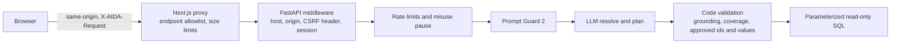

# AIDA security controls and attack tests

This document describes the account, abuse and data-isolation controls added in AIDA 4, the attacks they are tested against, and what they do not cover. Every control listed here is exercised by `backend/test_security.py` (32 tests) or by the interpreter and browser suites named below.

## Request path

## Controls

| Area | Control | Where |
| --- | --- | --- |
| Passwords | scrypt hashes with per-user salt; at least 10 characters with letters and a number, at least 5 distinct characters, must not contain the email name | `backend/core/auth.py` |
| Sessions | Random tokens stored only as SHA-256 hashes; `aida_session` cookie is HttpOnly, SameSite=Strict, Secure when `AIDA_COOKIE_SECURE=1`; 12-hour lifetime and 2-hour idle expiry; a new token on every sign-in (fixation protection); sign-out revokes the token server-side | `auth.py`, `api/auth_routes.py` |
| Brute force | Five failed sign-ins for one email lock it for 15 minutes; 20 sign-in attempts per client per minute; error messages are identical for unknown emails and wrong passwords | `core/security.py`, `auth_routes.py` |
| Sign-up abuse | Five sign-ups per client per hour; sign-up can be disabled with `AIDA_ALLOW_SIGNUP=0`; the first account is the owner | `auth_routes.py` |
| Cross-site requests | Every write needs the `X-AIDA-Request: 1` header and a same-origin `Origin`; the proxy rejects cross-origin writes; cookies are SameSite=Strict | `backend/main.py`, `frontend/app/api/v1/[...path]/route.ts` |
| Authorization | All data endpoints require a session when `AIDA_REQUIRE_AUTH=1`; only health and the auth endpoints are public; the security event log is owner-only | `main.py`, `api/guards.py` |
| Tenant isolation | Uploaded sources carry the uploader's id; other accounts receive "Unknown data source" for listing, inspection, configuration and queries; 20 uploads per account | `core/sources.py` |
| Question budget | 20 natural-language questions per user per minute, 120 explicit plans per minute, and a global 60 model-backed questions per minute that protects the provider quota; responses are HTTP 429 with `Retry-After` | `security.py`, `api/endpoints.py` |
| Prompt attacks | Meta Prompt Guard 2 (86M) screens each new question and blocks scores ≥ 0.9 before any planning call; the planning model is told the question is untrusted data and must refuse instruction changes | `core/interpreter.py` |
| Misuse pauses | Five refusals classified `prompt_injection` or `sensitive_data` within 10 minutes pause that user's questions for 15 minutes; the explicit query builder keeps working | `security.py`, `endpoints.py` |
| Meaning preservation | Code rejects model output that quotes words not in the question, drops or adds a condition, uses an unapproved id or value, or cites a number the user did not type | `interpreter.py` |
| SQL | Plans compile to quoted identifiers from the approved manifest and bound parameters; SQLite runs read-only and query-only with an authorizer, a two-second deadline and a 100-row bound | `core/relational.py`, `core/catalog_engine.py` |
| Uploads | 20 MB limit, SQLite header and integrity checks, and rejection of views, triggers, virtual tables and generated columns; opaque source ids prevent path traversal | `sources.py` |
| Secrets | `GROQ_API_KEY` is read from `backend/.env` (gitignored), hidden from config `repr`, never returned by any endpoint and never included in error messages; the Groq endpoint is pinned (no user-supplied model URLs) | `core/llm.py`, `core/settings.py` |
| Audit | Security events (sign-in failures, lockouts, rate limits, blocked questions, uploads) are stored without question text or passwords | `auth.py` |
| Headers | API: `Content-Security-Policy: default-src 'none'`, `X-Frame-Options: DENY`, `X-Content-Type-Options: nosniff`, CORP and `Permissions-Policy`; interactive API docs are disabled when authentication is on. Website: CSP, frame denial, COOP and `Permissions-Policy` | `main.py`, `frontend/next.config.js` |

## Attack and misuse tests

Run with `.\.venv\Scripts\python.exe -m pytest backend/test_security.py -q`.

| Attack | Expected outcome | Test |
| --- | --- | --- |
| Call any data endpoint without a session | 401, no data and no model call | `test_every_data_endpoint_requires_a_session` |
| Inspect the database after sign-up for plaintext secrets | Only password and token hashes are stored; cookie is HttpOnly and SameSite=Strict | `test_signup_sets_a_hardened_cookie_and_stores_only_hashes` |
| Register with weak passwords | Rejected with a validation message | `test_weak_passwords_are_rejected` |
| Register an existing email | Rejected without creating a session | `test_duplicate_account_does_not_create_a_session` |
| Guess passwords, probe for valid emails | Identical errors; the account locks after five failures | `test_login_errors_are_uniform_and_brute_force_locks_the_account` |
| Spray sign-ins from one client | 429 after the per-client budget | `test_login_attempts_are_rate_limited_per_client` |
| Session fixation, stolen or tampered tokens | Sign-in rotates the token; altered tokens are rejected | `test_session_fixation_and_stolen_or_tampered_tokens` |
| Reuse a token after sign-out or expiry | Rejected | `test_logout_and_expiry_revoke_tokens` |
| Cross-site form post | Rejected without the CSRF header or with a foreign origin | `test_cross_site_writes_are_rejected` |
| Flood the model with questions | 429 before the model is called | `test_questions_are_rate_limited_before_reaching_the_model` |
| Repeat prompt-injection attempts | Questions pause; events are logged without the question text | `test_repeated_injection_attempts_pause_questions_and_are_audited_without_text` |
| Read another account's upload | "Unknown data source" everywhere | `test_uploaded_sources_are_invisible_to_other_accounts` |
| Inject SQL through a structured plan | Validation rejects it; nothing executes | `test_structured_plan_injection_never_executes` |
| Traverse paths through a source id | Rejected | `test_source_identifiers_cannot_traverse_paths` |
| Upload a malicious or mislabelled file | Rejected | `test_malicious_or_mislabelled_uploads_are_rejected` |
| Clickjacking and content sniffing | Security headers on every API response | `test_api_responses_carry_security_headers` |
| Extract the hosted API key | Never present in any response | `test_hosted_api_key_is_never_returned` |
| Skip hosted-inference consent | Onboarding refuses; the logistics sample installs privately | `test_onboarding_needs_consent_for_hosted_inference_and_installs_a_private_sample` |

Interpreter-level attacks (quoted words that are not in the question, invented filters, unapproved values, ungrounded numbers, instruction-override questions, and malformed or wrongly typed model json that must be rejected rather than crash the server) are covered in `backend/test_interpreter.py`. The browser journey `scripts/e2e-auth.cjs` checks the redirect for signed-out users, the cookie flags, password validation, sign-out revocation and the uniform sign-in error in a real browser.

## Limits and residual risk

- Rate-limit and misuse counters are in-process. Run one backend worker, or move the counters to a shared store before scaling out.
- There is no email verification, password reset, multi-factor authentication or organization invitation flow yet.
- With `AIDA_MODEL_PROVIDER=groq`, question text and approved catalog labels, definitions and allowed values leave the server for Groq. Onboarding requires explicit consent. Use the local provider when questions themselves are confidential.
- Prompt Guard and the planning model reduce, but cannot eliminate, prompt-injection risk. The safety property that matters is structural: a manipulated model can only return a plan over approved ids and values, and code refuses anything else.
- The website CSP allows inline scripts because Next.js hydration requires them.
- Aggregates can still reveal information about small groups; there is no minimum group size or differential privacy.
- If an API key has appeared in logs, chat transcripts or screenshots, rotate it in the Groq console and update `backend/.env`.
